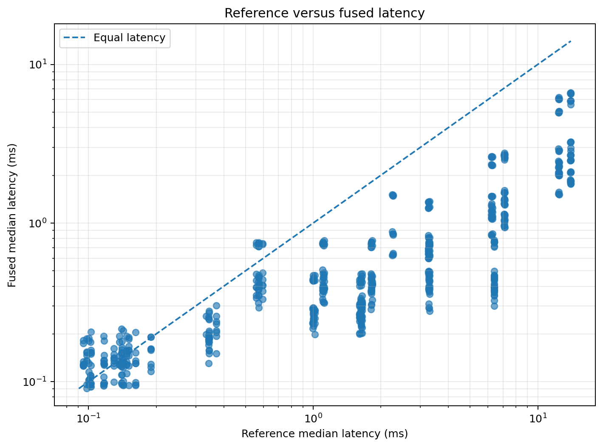
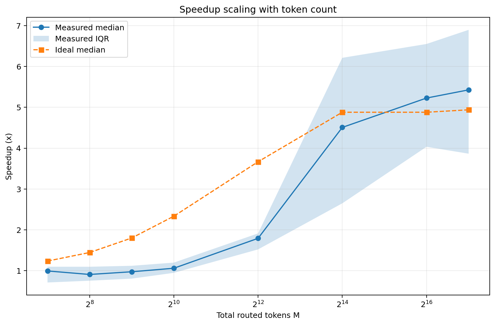
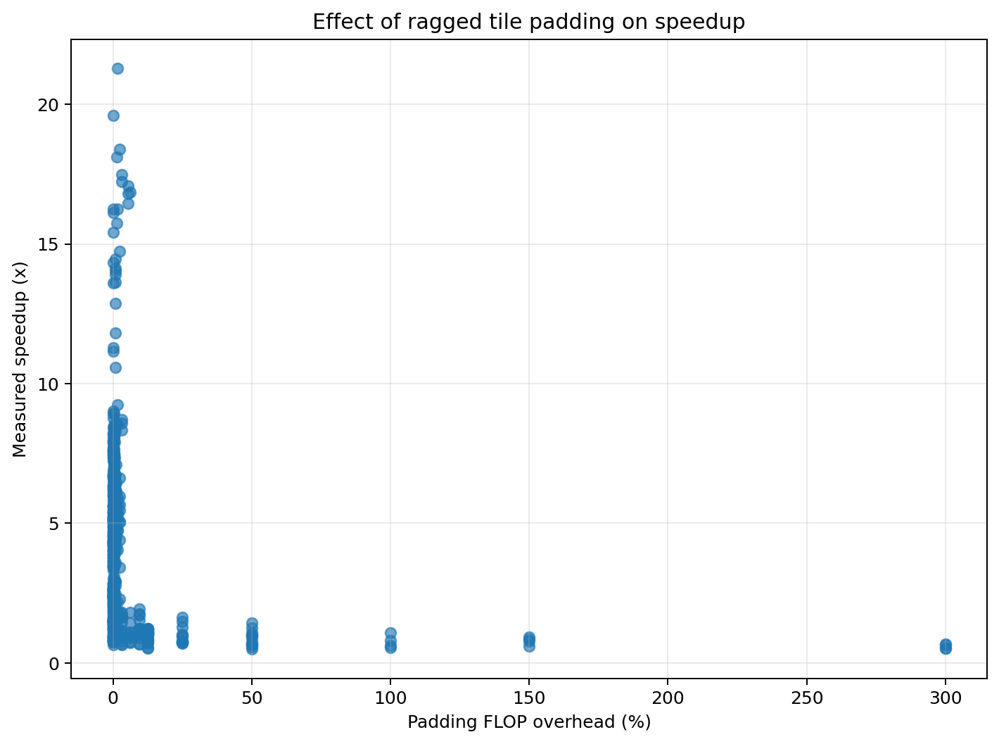
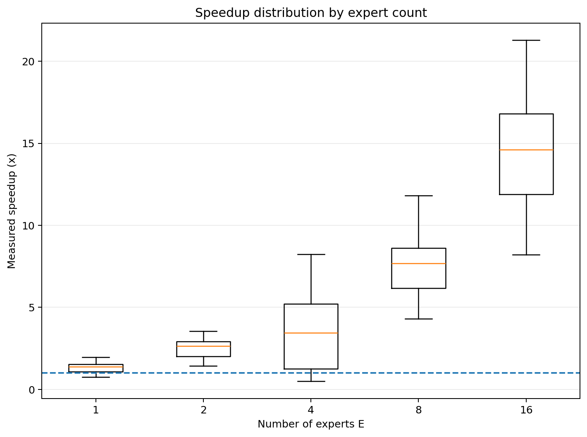
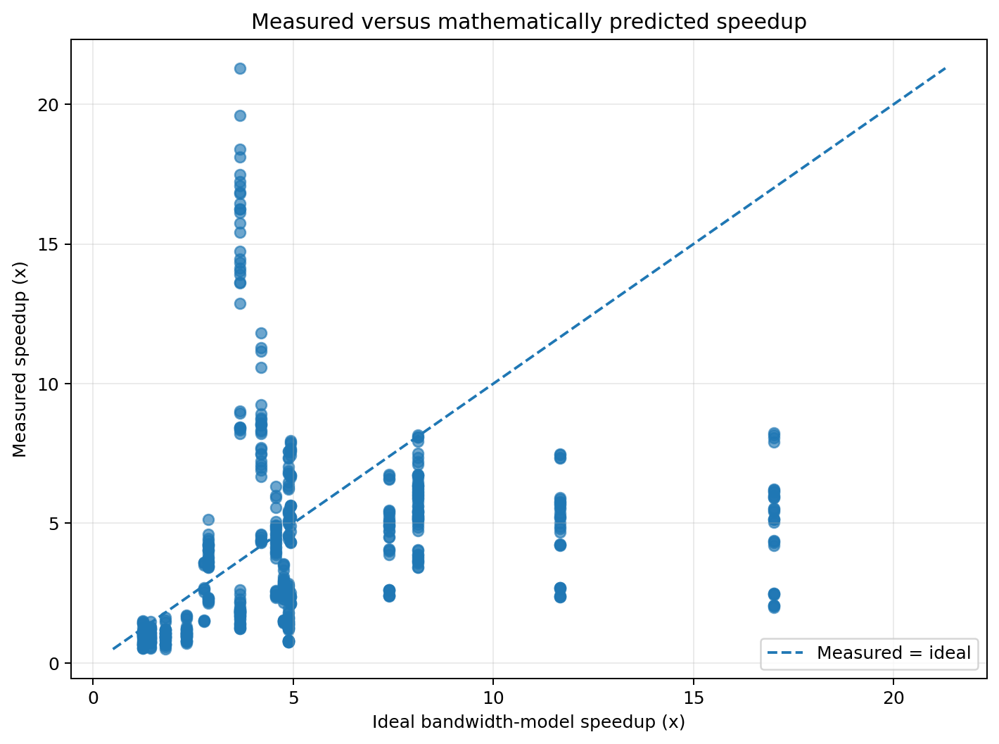
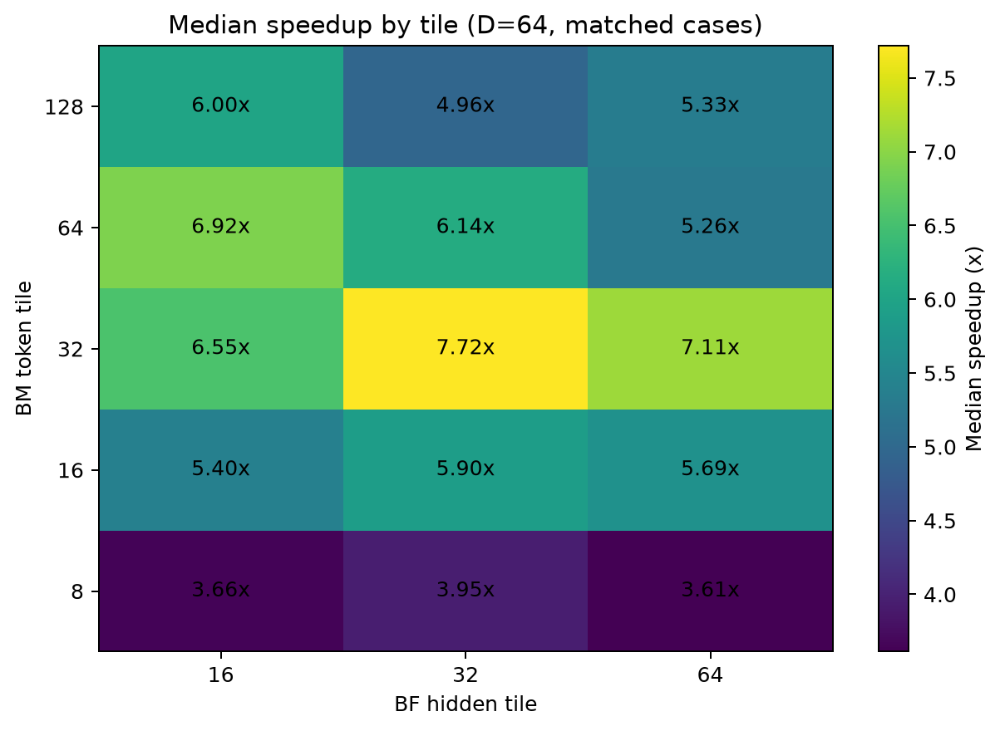

# Fused MoE MLP Kernel in Pallas (JAX)

A custom GPU kernel that fuses the expert MLP of a Mixture-of-Experts
transformer, up-projection → GELU → down-projection, into a single Pallas
kernel, replacing the two `jax.lax.ragged_dot` calls that would otherwise
materialize the `(M, F)` hidden activation in HBM.

Grew out of my [Chinchilla scaling-laws project](https://github.com/KrushnaBhanushali/chinchilla-scaling-jax),
and idea from Vlad Feinberg post on learning pre-training and scaling.(https://vladfeinberg.com/2026/05/10/how-to-land-a-job-at-a-frontier-lab.html) where the MoE model's expert MLP is exactly this pair of ragged matmuls.

## The kernel

Tokens are pre-sorted by expert. The grid is `(E, max_group_size / BM)`:
each program owns one `BM`-token block of one expert's token range, streams
the expert's `W_up`/`W_down` in `BF`-sized chunks of the hidden dimension,
and accumulates the `(BM, D)` output in registers the `(BM, BF)` hidden
activation never leaves on-chip memory

```
X: (M, D)  sorted by expert, ragged group sizes
W_up:   (E, D, F)      H = GELU(X @ W_up[e])      (never written to HBM)
W_down: (E, F, D)      Y = H @ W_down[e]          accumulated over BF chunks
```

## What's here

| File | Contents |
|---|---|
| `src/kernel.py` | The fused kernel, its `pallas_call` wrapper, and the `ragged_dot` reference implementations |
| `src/practice.py` | Warm-up Pallas kernels (iota, copy, masked block ops) the learning progression from Pallas Docs|
| `src/benchmark.py` | Latency/throughput sweep vs. the XLA reference: median-of-N timing, TFLOP/s, tokens/s, numerical-acceptance gate |
| `src/analysis.py` | Roofline & memory-traffic model: arithmetic intensity, best/worst-case HBM traffic, shared-memory estimates per block config |
| `tests/check_correctness.py` | Element-wise comparison against `ragged_dot` reference (abs/rel/L2 error, worst-entry report) |
| `profiling/profile_kernels.py` | Traces fused vs. reference with `jax.profiler` (perfetto/xprof) |
| `src/ragged_moe_speedup_experiment.py` | Sweep harness: full-grid case generation to run experiment|
| `src/analyze_results.py` | Analysis of a finished sweep: speedup vs. M, cost vs. E, roofline efficiency, shared-memory model validation |
| `notebooks/ragged_moe_colab_runner.ipynb` | Runs the sweep on a Colab GPU|
| `results/structured_float32/` | The sweep output analysed below: 584 cases, summary tables, plots |

## Run

```bash
pip install -r requirements.txt

# Correctness (CPU-friendly: interpret mode)
PYTHONPATH=. python tests/check_correctness.py

# Benchmark sweep (needs a GPU; edit M/D/F/BM/BF at the bottom)
PYTHONPATH=. python -c "from src.benchmark import run_sweep; \
    print(run_sweep(M_values=[2**14, 2**16, 2**18], D=128, F=1024, BM=128, BF=16))"

# Profile traces (GPU), then: xprof --logdir jax_profiles
PYTHONPATH=. python profiling/profile_kernels.py
```

## Results

**584 benchmarked configurations on an NVIDIA L4**, sweeping routed tokens
M ∈ [128, 131072], model dim D ∈ [64, 256], hidden dim F ∈ [256, 4096],
experts E ∈ [1, 16], tile sizes BM ∈ [8, 128], BF ∈ [16, 64], and four routing
distributions. Every case is timed as median-of-10 after warmup and checked
against the `ragged_dot` reference.

| | |
|---|---|
| Median speedup | **3.5×** |
| Best case | **21.3×** (M=16384, E=16, BM=32, BF=32) |
| Cases faster than XLA | 510 / 584 |
| Numerically valid | **584 / 584** (max L2 relative error 9.1×10⁻⁶) |
| Best fused throughput | 22.8 TFLOP/s (75% of L4 fp32 peak) |

Every case, fused vs. reference everything below the diagonal is a speedup:



### Fusion pays off above ~1K tokens



| M | 128 | 512 | 1024 | 4096 | 16384 | 65536 | 131072 |
|---|---|---|---|---|---|---|---|
| Median speedup | 0.99× | 0.97× | 1.06× | 1.79× | 4.51× | 5.23× | 5.43× |

Past M≈4096 the avoided HBM round-trip dominates. For exapmle, when M=131072, F=512 the
reference writes and re-reads a **256 MiB** hidden activation that the fused
kernel never materializes.

Below ~1K tokens the kernel doesn't only barely faster or is slightly slower, and the mechanism is
**ragged-tile padding**, not launch overhead. Each expert's token count is
rounded up to a multiple of `BM`, so the wasted fraction grows as `M/E` shrinks
relative to the tile: at M=128, E=16, BM=32 the kernel computes 32 rows for 8
real tokens a **300% overcompute**. The correlation across all 584 cases is
clean and monotone:

| Padding FLOP overhead | <1% | 1–10% | 10–50% | >50% |
|---|---|---|---|---|
| Cases | 434 | 89 | 49 | 12 |
| Median speedup | **4.09×** | 1.86× | 0.99× | 0.66× |




Note also that the measured speedup *crosses* the ideal-bandwidth prediction
around M≈65536 and keeps climbing. 

### The improvment: XLA's `ragged_dot` costs O(E), the fused kernel doesn't

Holding M, D, F fixed and varying only the expert count, so the useful FLOPs
(4.3 GFLOP) and the minimum HBM traffic (80→88 MiB) are essentially constant:

| E | 1 | 2 | 4 | 8 | 16 |
|---|---|---|---|---|---|
| Reference (ms) | 0.572 | 1.109 | 1.819 | 3.280 | 6.389 |
| **Fused (ms)** | **0.419** | **0.419** | **0.424** | **0.428** | **0.438** |
| Speedup | 1.36× | 2.65× | 4.29× | 7.66× | 14.60× |



The reference roughly **doubles in cost every time the expert count doubles**,
despite doing the same arithmetic on the same bytes: XLA's `ragged_dot` appears
to do work proportional to E rather than to the number of tokens actually
routed. The fused kernel is flat to within 5% across a 16× change in E, because
its grid only covers real token blocks (`@pl.when(m_start < expert_end)` retires
the rest).




| F | 256 | 512 | 1024 | 2048 | 4096 |
|---|---|---|---|---|---|
| Ideal | 2.9× | 4.2× | 7.4× | 11.7× | 17.0× |
| Measured | 3.7× | 2.6× | 4.8× | 5.1× | 5.3× |
| % of ideal | 127% | 66% | 65% | 44% | **31%** |

Measured speedup does keep improving with F just far more slowly than a
perfect-reuse model implies. 

### How the numbers are computed

Worked on one configuration, M=16384, D=128, F=512, E=4, float32.

**Arithmetic.** Two matmuls, `(M,D)@(D,F)` then `(M,F)@(F,D)`, each
`2·M·D·F` FLOPs since a multiply-add is 2:

```
useful_flops = 4·M·D·F = 4.295 GFLOP        (identical for both implementations)
```

**HBM traffic.** The only structural difference is the hidden activation:

```
reference = 4·M·D      read X                     8.4 MB
          + 8·E·D·F    read W_up, W_down          2.1 MB
          + 8·M·F      write H, then read it back 67.1 MB   <- fusion removes this
          + 4·M·D      write Y                    8.4 MB    = 82.0 MiB

fused     = the same, without the H term                    = 18.0 MiB
```

`ideal_memory_speedup = 82.0 / 18.0 = 4.56x`. That is a pure bandwidth
prediction: if both kernels were perfectly memory-bound, moving 4.56x fewer
bytes would take 4.56x less time.

**Arithmetic intensity** is FLOPs per byte:

```
reference  4.295e9 / 85,983,232 =  50 FLOP/byte
fused      4.295e9 / 18,874,368 = 228 FLOP/byte
```

**Ridge point.** The L4 sustains 30.3 TFLOP/s and 300 GB/s, so it breaks even
at `30.3e12 / 300e9 = 101 FLOP/byte`. Below that a kernel is starved for
bandwidth, above it the ALUs are the limit. The reference sits at 50, the fused
kernel at 228 — fusion moves the operation across the ridge.

**Roofline time** is whichever bound is worse:

```
            compute = FLOPs/30.3e12    memory = bytes/300e9      roofline
reference     0.1417 ms                  0.2866 ms          ->   0.2866 ms  (memory)
fused         0.1417 ms                  0.0629 ms          ->   0.1417 ms  (compute)
```

**Efficiency** is roofline / measured, i.e. how close the kernel got to the best
the hardware allows for its byte and FLOP profile:

```
reference  0.2866 / 1.819 = 15.8%
fused      0.1417 / 0.424 = 33.4%
```

**Speedup** involves no model at all: measured wall-clock,
`1.819 / 0.424 = 4.29x`, median of 10 timed calls after warmup with
`block_until_ready()`. `% of ideal` is then `4.29 / 4.56 = 94%`.

### Roofline

Recomputed at the L4's true fp32 peaks (30.3 TFLOP/s, 300 GB/s, ridge point
101 FLOP/byte) with `src/analyze_results.py`:

| E | 1 | 2 | 4 | 8 | 16 |
|---|---|---|---|---|---|
| Reference, % of its roofline | 49% | 26% | 16% | 9.0% | 4.8% |
| **Fused, % of its roofline** | **34%** | **34%** | **33%** | **33%** | **33%** |

Fusion moves the operation across the balance point: the reference sits at
~47–51 FLOP/byte (memory-bound in all 584 cases), while the fused kernel reaches
~170–250 FLOP/byte and is compute-bound in 458 of 584. Its efficiency is
*flat*, the same fraction of achievable peak regardless of expert count.


### Choosing tiles

`BM=32, BF=32` is the best tile: it wins **56 of 72** per-shape optima, and
`BM=32` in some form wins 63 of 72. Comparing at a matched problem size
(D=64, where all three BF values have the same 20 cases):

| median speedup | BF=16 | BF=32 | BF=64 |
|---|---|---|---|
| BM=8 | 3.66× | 3.95× | 3.61× |
| **BM=32** | 6.55× | **7.72×** | 7.11× |
| BM=64 | 6.92× | 6.14× | 5.27× |
| BM=128 | 6.00× | 4.96× | 5.33× |




### The shared-memory ceiling

2,210 configurations failed to compile **every one** with
`RESOURCE_EXHAUSTED: Shared memory size limit exceeded`, against the L4's
101,376-byte limit. 

The source-level tile model in `src/analysis.py` is

```
bytes = 4 · (2·BM·D + 2·D·BF + BM·BF)
```

Comparing it against the sizes the compiler actually requested (median ratio):

| request / model | BF=16 | BF=32 | BF=64 | BF=128 |
|---|---|---|---|---|
| D=128 | — | 0.86 | 1.46 | 1.64 |
| D=256 | 0.74 | 1.24 | 1.48 | 1.67 |
| D=512 | 1.00 | 1.25 | 1.49 | 1.68 |
| D=1024 | 1.00 | 1.25 | 1.50 | 1.69 |

The model gets the right order of magnitude and the right scaling, but it is
**not** what the compiler allocates.

Practically: on this GPU **D ≥ 512 never compiles at any tile size in the
sweep** the smallest tile tried (BM=8, BF=16, D=512) still requested 147,968
bytes against the 101,376 available which is why the successful runs cover
D ≤ 256.

### Load imbalance barely matters

| Routing | balanced | mild | skewed | one-dominant |
|---|---|---|---|---|
| Median speedup | 3.51× | 3.51× | 3.50× | 3.47× |
| Padding overhead | 0.0% | 0.39% | 0.39% | 0.59% |

A 70/30 one-dominant split costs ~1% of the speedup. Ragged tiling means only
the last partial block of each expert wastes lanes, so padding overhead stays
under 1% of FLOPs even under heavy skew so the kernel doesn't need balanced
routing to perform.

### Reproducing this analysis

```bash
python src/analyze_results.py results/structured_float32 \
    --peak-compute-tflops 30.3 --peak-bandwidth-gbps 300
```

### Notes

- Single GPU (L4), float32 only. 
- The reference is `jax.lax.ragged_dot` as compiled by XLA in JAX 0.7.2.
- Timing is wall-clock median-of-10 with `block_until_ready`, not kernel-only
  device time.
